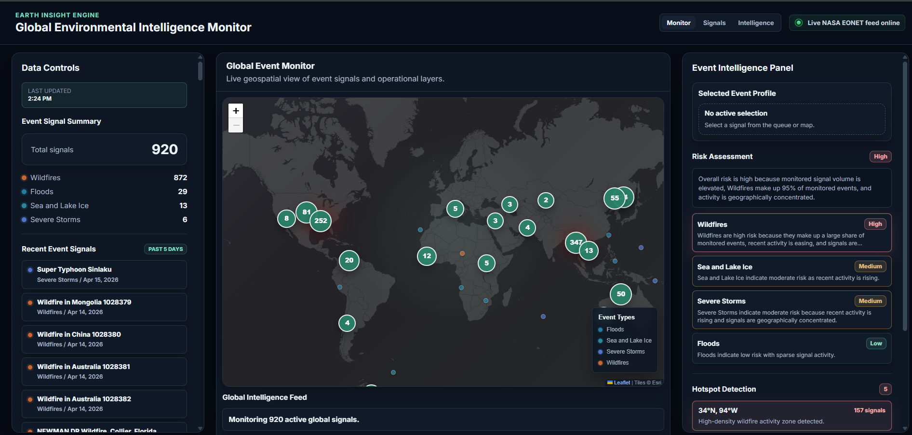
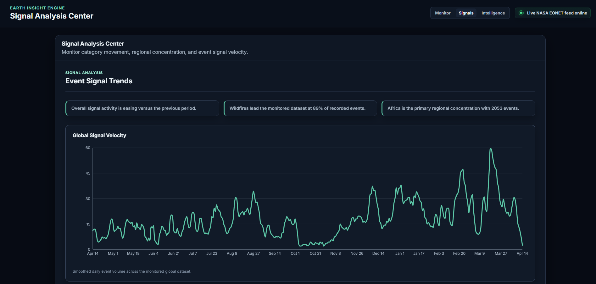
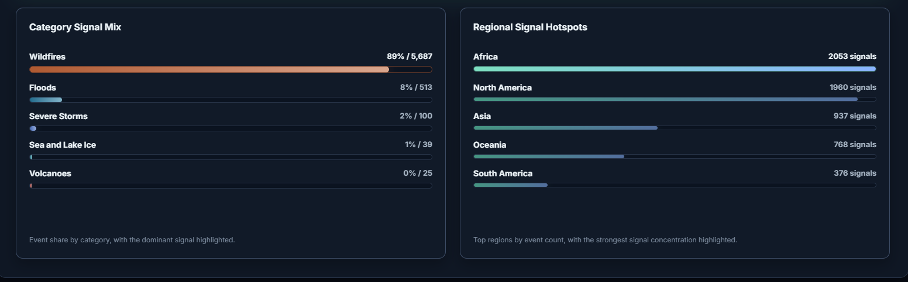
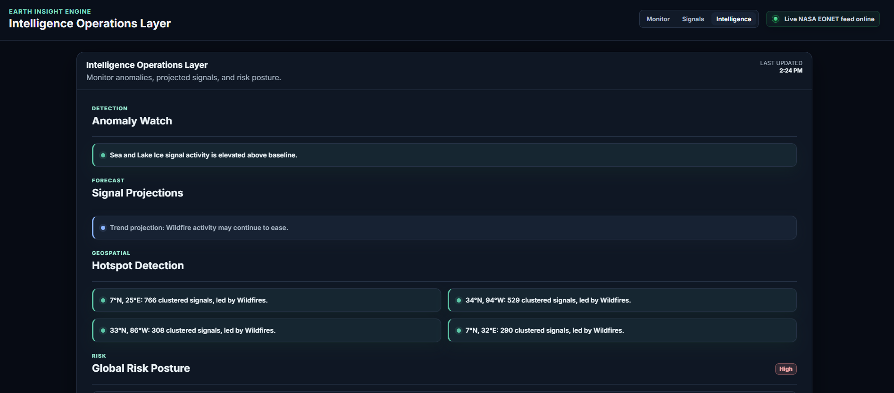
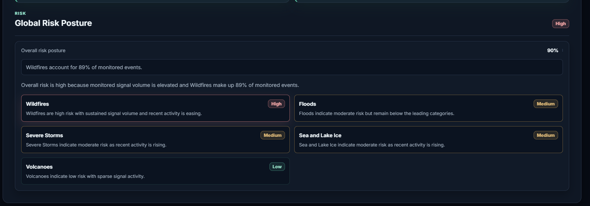

# 🌍 Earth Insight Engine  
### Environmental Intelligence Platform powered by NASA EONET

Earth Insight Engine is a real-time environmental intelligence system that transforms NASA EONET event data into actionable insights through geospatial visualization, trend analysis, and risk modeling.

---

## 🚀 Overview

This platform goes beyond simple data visualization by introducing an intelligence layer that detects patterns, highlights emerging hotspots, and evaluates environmental risk signals globally.

It is designed to simulate a **mission-control-style monitoring system** for environmental events.

---

## 🧠 Core Capabilities

### 🌐 Global Signal Monitor
- Interactive world map powered by Leaflet
- Real-time visualization of environmental events
- Marker clustering and category-based color coding
- Signal density hotspot detection

### 📊 Signal Analysis (Analytics)
- Event trend analysis over time
- Category distribution and dominance
- Regional hotspot identification
- Signal velocity tracking

### 🧠 Intelligence Layer
- Anomaly detection for unusual activity patterns
- Trend-based projection insights
- Global risk posture analysis
- Category-level risk assessment

### ⚙️ Data Controls
- Dynamic filtering:
  - Date range (30 / 90 / 365 days)
  - Event status (open / closed)
  - Category selection
- Timeline playback for temporal analysis

---

## 🏗️ Architecture

- Global data layer using React Context (single fetch, shared across app)
- Memoized computations for performance optimization
- Modular page structure:
  - Monitor (Dashboard)
  - Signals (Analytics)
  - Intelligence
- Smooth loading system with initial data initialization screen

---

## ⚡ Performance & UX

- Data fetched once and reused globally
- Heavy computations optimized with `useMemo`
- Instant navigation after initial load
- Full-screen loading system for first render
- Subtle animations and transitions for a premium UI feel

---

## 🛠️ Tech Stack

- React + TypeScript + Vite
- Leaflet (map rendering)
- React-Leaflet
- Context API (global state)
- CSS (custom dark monitoring theme)

---

## 📸 Screenshots
- Main Page

- Signals Page:

- Intelligence page

---

## 🌐 Data Source

- NASA EONET API  
  https://eonet.gsfc.nasa.gov/

---

## ⚠️ Disclaimer

This system uses heuristic-based analysis for anomaly detection, trend insights, and risk assessment.  
It is intended for exploratory and visualization purposes and does not represent a scientifically validated predictive model.

---

## 🚀 Future Improvements

- Advanced ML-based prediction models
- Confidence scoring for insights
- Real-time streaming data integration
- Enhanced geospatial clustering algorithms

---

## 👨‍💻 Author

Built as an environmental intelligence system prototype demonstrating real-time data processing, geospatial visualization, and layered analytics.